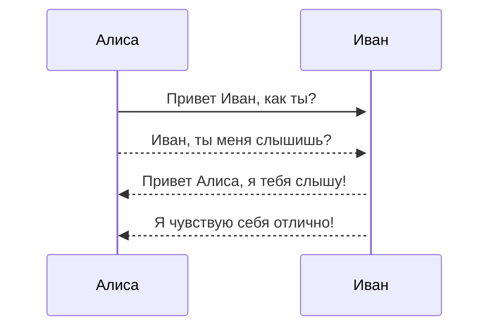
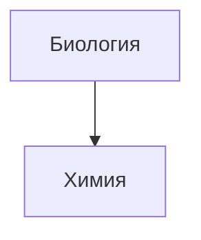

```bsl
	array = Новый Массив;
	Функция СделатьЧтоТо() Экспорт
		Для Каждого е из Коллекция Цикл
			Если <Условие>  И <Условие2> Тогда
				
			КонецЕсли;
		КонецЦикла;
	КонецФункции 
```

![Схема FBS Стандарт OZON]


![[Pasted image 20240427150158.png|500x500]]


```js
	function fancyAlert(arg) { if(arg) { $.facebox({div:'#foo'}) } }
```


- [ ] поддерживаются #теги, [Заметка 3](), **форматирование**
- [ ] #используется ==синтаксис== списка (поддерживаются упорядоченный или не ~~упорядоченный списки)~~
- [x] это завершенная задача
- [x] это тоже завершенная задача (работает с любым символом)
- [ ] это незавершенная задача
- [ ] задачи в области предварительного просмотра помечаются завершенными при нажатии на чекбокс








<iframe 
border=0 
frameborder=0
   width="560" height="315" src="https://www.youtube.com/embed/WlIzoLK46is?si=j9gBoHq0KYPN6FhH" title="YouTube video player" frameborder="0" allow="accelerometer; autoplay; clipboard-write; encrypted-media; gyroscope; picture-in-picture; web-share" referrerpolicy="strict-origin-when-cross-origin" allowfullscreen></iframe>
